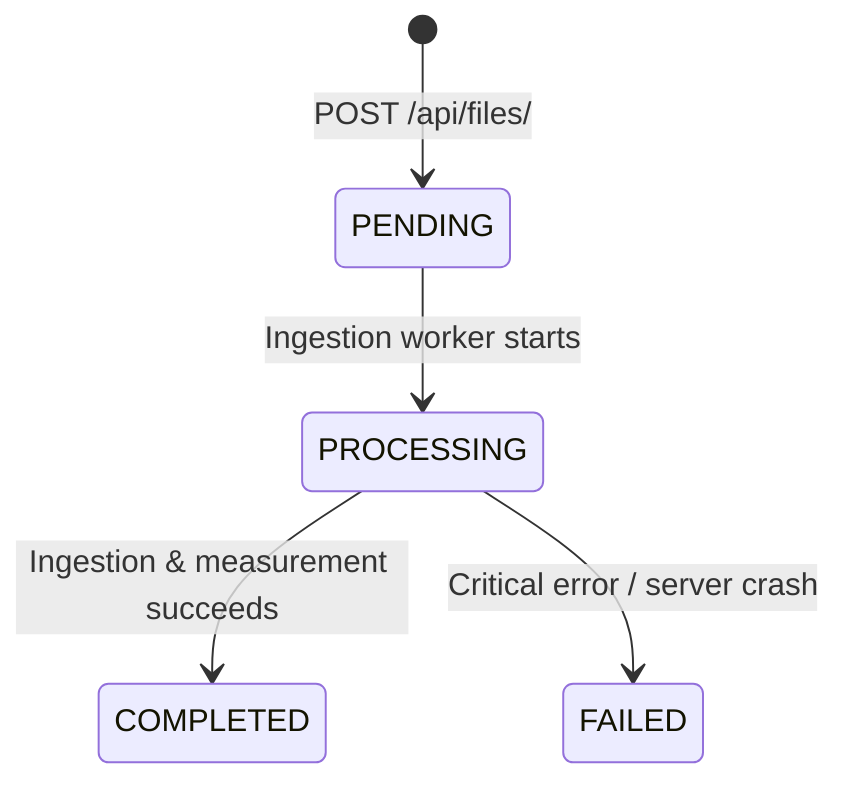
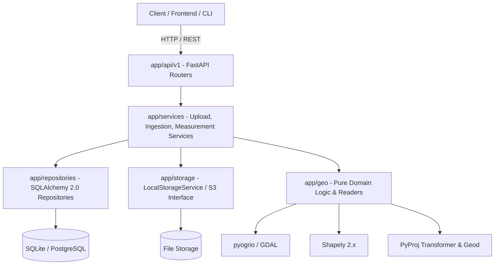
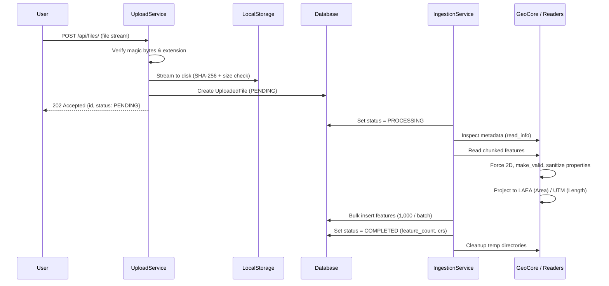

# Geospatial File Measurement API

[](https://fastapi.tiangolo.com)
[](https://www.python.org/)
[](https://www.postgresql.org/)
[](https://geopandas.org/)
[](tests/)
[](https://github.com/astral-sh/ruff)

A production-grade backend service built with **FastAPI**, **Pydantic v2**, **SQLAlchemy 2.0**, **GeoPandas + pyogrio**, **Shapely 2.x**, and **PyProj**. The service accepts geospatial files (`.zip` Shapefiles and `.kml` documents), normalizes and validates geographic geometries, performs accurate metric measurements using dynamic equal-area and conformal projections, cross-validates results with WGS84 geodesics, and persists results with chunked streaming.

---

## Table of Contents

- [Features](#features)
- [Quickstart](#quickstart)
  - [Docker Compose (Production)](#docker-compose-production)
  - [Local Development Environment](#local-development-environment)
  - [Environment Variables](#environment-variables)
- [API Reference](#api-reference)
  - [Status Lifecycle](#status-lifecycle)
  - [1. Upload Geospatial File](#1-upload-geospatial-file)
  - [2. Get File Information](#2-get-file-information)
  - [3. Get Feature Measurements](#3-get-feature-measurements)
  - [Error Schema](#error-schema)
- [Architecture](#architecture)
  - [System Layer Diagram](#system-layer-diagram)
  - [Ingestion Flow](#ingestion-flow)
- [CRS Auto-Selection & Projection Strategy](#crs-auto-selection--projection-strategy)
- [Design Decisions & Alternatives](#design-decisions--alternatives)
- [Edge Cases Handled](#edge-cases-handled)
- [Testing & Geodesic Validation](#testing--geodesic-validation)
- [Known Limitations](#known-limitations)
- [Learnings & Future Scope](#learnings--future-scope)

---

## Features

- **Strict Separation of Concerns**: Pure domain logic in `app/geo/` with zero FastAPI or database dependencies.
- **Dynamic Equal-Area & Conformal Projections**:
  - **Polygons (Area & Perimeter)**: Projected via custom per-feature **Lambert Azimuthal Equal Area (LAEA)** centered on feature centroid.
  - **LineStrings (Length)**: Projected via dynamically calculated **Auto-UTM zones**, falling back to LAEA if longitudinal span exceeds 6° or is polar.
- **Geodesic Cross-Validation**: Validates projected planar calculations against WGS84 ellipsoidal geodesics using `pyproj.Geod` (discrepancy < 0.5%).
- **Streaming & Memory Safety**: 1 MB chunked upload writes, `pyogrio` header inspection (`read_info`), and batch feature insertions (1,000 items/batch).
- **Hardened Archive Security**: Defends against Zip-Slip path traversal and Zip-Bomb exhaustion attacks (limits on member count, uncompressed size, and compression ratio).
- **Graceful Fault Tolerance**: Feature-level error isolation ensures invalid individual geometries never fail an entire dataset.
- **Crash Recovery**: Automatically transitions orphaned `PROCESSING` jobs to `FAILED` upon server restart.

---

## Quickstart

### Docker Compose (Production)

To launch the API alongside PostgreSQL 16:

```bash
docker compose up --build -d
```

- **Swagger UI**: [http://localhost:8000/docs](http://localhost:8000/docs)
- **Health Check**: [http://localhost:8000/health](http://localhost:8000/health)

To view logs and run migrations:
```bash
docker compose logs -f app
```

### Local Development Environment

```bash
# 1. Clone repository
git clone <repo-url>
cd geo-measure-api

# 2. Create virtual environment
python -m venv .venv
# Windows:
.\.venv\Scripts\activate
# Linux/macOS:
source .venv/bin/activate

# 3. Install dependencies
pip install -e .[dev]

# 4. Apply database migrations
alembic upgrade head

# 5. Start development server
uvicorn app.main:app --reload --port 8000
```

### Environment Variables

Configuration is loaded from environment variables and `.env`:

| Variable | Type | Default | Description |
| :--- | :--- | :--- | :--- |
| `DATABASE_URL` | `str` | `sqlite:///./geo_measure.db` | SQLAlchemy connection string (SQLite or PostgreSQL) |
| `MAX_UPLOAD_MB` | `int` | `50` | Maximum file upload size in MB (HTTP 413 if exceeded) |
| `MAX_ZIP_UNCOMPRESSED_MB` | `int` | `250` | Maximum allowable uncompressed archive size |
| `MAX_ZIP_MEMBERS` | `int` | `1000` | Maximum files allowed inside a zip archive |
| `PROCESSING_MODE` | `str` | `background` | `background` (FastAPI BackgroundTasks) or `sync` (inline) |
| `ASSUME_WGS84_IF_MISSING`| `bool` | `true` | Assume `EPSG:4326` if `.prj` is missing and bounds fit `[-180, 180] x [-90, 90]` |
| `UPLOAD_DIR` | `str` | `./uploads` | Directory for staged file persistence |

---

## API Reference

### Status Lifecycle



---

### 1. Upload Geospatial File

**Endpoint**: `POST /api/files/`  
**Status**: `202 Accepted`  
**Content-Type**: `multipart/form-data`

```bash
curl -X POST "http://localhost:8000/api/files/" \
  -F "file=@survey.kml"
```

**Response**:
```json
{
  "id": "c1f7b7a8-3481-42a1-b845-d85c8e404bf0",
  "filename": "survey.kml",
  "status": "PENDING"
}
```

---

### 2. Get File Information

**Endpoint**: `GET /api/files/{id}/`  
**Status**: `200 OK`

```bash
curl -X GET "http://localhost:8000/api/files/c1f7b7a8-3481-42a1-b845-d85c8e404bf0/"
```

**Response**:
```json
{
  "id": "c1f7b7a8-3481-42a1-b845-d85c8e404bf0",
  "filename": "survey.kml",
  "format": "KML",
  "size_bytes": 14208,
  "sha256": "4b680517f8a7e089d81d289063fcfbb8e7d242ef998246d84fbbfe7a52e1858a",
  "status": "COMPLETED",
  "crs": "EPSG:4326",
  "crs_assumed": false,
  "feature_count": 12,
  "error_message": null,
  "created_at": "2026-10-07T14:15:30.123456Z",
  "completed_at": "2026-10-07T14:15:30.987654Z"
}
```

---

### 3. Get Feature Measurements

**Endpoint**: `GET /api/files/{id}/measurements/?limit=100&offset=0&include_geometry=true`  
**Status**: `200 OK` (or `409 Conflict` if processing is incomplete)

```bash
curl -X GET "http://localhost:8000/api/files/c1f7b7a8-3481-42a1-b845-d85c8e404bf0/measurements/"
```

**Response**:
```json
{
  "file_id": "c1f7b7a8-3481-42a1-b845-d85c8e404bf0",
  "total": 1,
  "limit": 100,
  "offset": 0,
  "features": [
    {
      "index": 0,
      "geometry_type": "Polygon",
      "source_crs": "EPSG:4326",
      "measurement_status": "OK",
      "measurements": {
        "area_m2": 15231.42,
        "perimeter_m": 512.84,
        "length_m": null
      },
      "measurement_crs": "+proj=laea +lat_0=12.971600 +lon_0=77.594600 +datum=WGS84 +units=m +no_defs",
      "method": "laea_equal_area",
      "properties": {
        "name": "Plot A",
        "zone": "Commercial"
      },
      "geometry": {
        "type": "Polygon",
        "coordinates": [[[77.594, 12.971], [77.595, 12.971], [77.595, 12.972], [77.594, 12.972], [77.594, 12.971]]]
      },
      "warnings": []
    }
  ]
}
```

---

### Error Schema

All errors follow a uniform, structured envelope:

```json
{
  "error": {
    "code": "INVALID_ARCHIVE",
    "message": "Uploaded file is not a valid ZIP archive.",
    "details": {}
  }
}
```

| HTTP Status | Code | Meaning |
| :--- | :--- | :--- |
| `404` | `NOT_FOUND` | File ID not found |
| `409` | `NOT_READY` | Measurements requested before ingestion is complete |
| `413` | `PAYLOAD_TOO_LARGE` | Upload exceeds `MAX_UPLOAD_MB` |
| `415` | `UNSUPPORTED_FORMAT` | Format is not `.zip` or `.kml` |
| `422` | `INVALID_ARCHIVE` | Zip-slip, zip-bomb, or corrupt archive |
| `422` | `MISSING_COMPONENT` | Shapefile missing `.shp` or `.dbf` |
| `422` | `UNREADABLE_FILE` | GDAL/pyogrio failed parsing geospatial data |

---

## Architecture

### System Layer Diagram



### Ingestion Flow



---

## CRS Auto-Selection & Projection Strategy

### Rule: Never Measure in Degrees
Degrees are angular coordinates, not linear measurements. Calculating Euclidean distance or area on degrees produces severe distortions that vary drastically with latitude.

### 1. Area & Perimeter: Lambert Azimuthal Equal Area (LAEA)
For polygons, the system synthesizes a per-feature LAEA projection centered on the feature's centroid:
$$\text{PROJ: } +proj=laea +lat\_0=\phi_{c} +lon\_0=\lambda_{c} +datum=WGS84 +units=m$$
- **Preserves area exactly** everywhere on the globe.
- Free of UTM zone-boundary seams.
- Handles multi-zone and antimeridian-spanning geometries seamlessly.

### 2. Length: Conformal Auto-UTM
For LineStrings, the system determines the local UTM zone from centroid longitude ($\lambda_c$) and latitude ($\phi_c$):
$$\text{zone} = \min\left(60, \max\left(1, \left\lfloor \frac{\lambda_c + 180}{6} \right\rfloor + 1\right)\right)$$
$$\text{EPSG} = \begin{cases} 32600 + \text{zone} & \text{if } \phi_c \ge 0 \text{ (North)} \\ 32700 + \text{zone} & \text{if } \phi_c < 0 \text{ (South)} \end{cases}$$
- **Scale factor distortion is $< 0.1\%$** ($0.9996$ at central meridian, $1.0010$ at zone edges).
- **Fallback**: If longitudinal span exceeds $6^\circ$ or centroid is polar ($|\phi_c| > 84^\circ\text{N}$ or $80^\circ\text{S}$), switches automatically to LAEA to avoid UTM singularities.

### 3. Axis Order Safety
All transformations instantiate `pyproj.Transformer` with `always_xy=True`, preventing longitude/latitude axis-order inversion bugs across varying PROJ versions.

---

## Design Decisions & Alternatives

| Decision | Chosen Solution | Alternative Considered | Rationale |
| :--- | :--- | :--- | :--- |
| **Vector Engine** | **`pyogrio`** | `Fiona` | Pyogrio is the default engine in GeoPandas 1.0; its wheels bundle compiled GDAL (no apt-get required in Docker), and it supports zero-copy reading & chunked streaming. |
| **Worker Strategy** | **`BackgroundTasks`** | `Celery + Redis` | Keeps deployment lightweight (zero external broker required for assignment evaluation), while isolating worker logic behind a service layer ready for Celery. |
| **Storage Engine** | **`SQLite / PostgreSQL`** | `PostGIS` | Geometry is stored as GeoJSON text in JSON columns, eliminating heavy PostGIS dependencies while keeping calculations pure in Python. |
| **Area Strategy** | **Per-feature LAEA** | `UTM` or `EPSG:6933` | UTM distorts area up to 0.2% and fails across zone borders; LAEA preserves metric area exactly. |
| **Length Strategy** | **Auto-UTM** | `Geodesic distance` | UTM preserves angles (conformal) and local scale accurately; planar projection enables vectorised Shapely operations. |

---

## Edge Cases Handled

| Edge Case | Defense & Handling |
| :--- | :--- |
| **Zip-Slip (`../`)** | Basename sanitization + strict path containment verification (`startswith(target_dir)`). |
| **Zip-Bomb** | Caps total uncompressed size (250MB), member count (1,000), and compression ratio (100x). |
| **Missing `.shp` / `.dbf`** | Rejects with `422 MISSING_COMPONENT` specifying the missing file name. |
| **Missing `.shx`** | Auto-heals by enabling `SHAPE_RESTORE_SHX=YES` before reading. |
| **Missing `.prj`** | Inspects bounding box; assumes `EPSG:4326` if within $[-180, 180] \times [-90, 90]$, sets `crs_assumed=True`. |
| **3D / Z Coordinates** | Automatically strips third dimension via `shapely.force_2d`; attaches planar projection warning. |
| **Self-Intersections** | Auto-repaired via `shapely.make_valid`; captures warning without crashing file. |
| **Polygon Holes** | Shapely area formula automatically subtracts inner linear rings (verified by unit test). |
| **Points / MultiPoints** | Flagged as `UNSUPPORTED` status without calculation; does not crash pipeline. |
| **Multi-Geometry** | Computes sum of polygon areas and sum of line lengths across components. |
| **Non-JSON Properties** | Sanitizes `np.int64`, `np.float64`, `NaN`, `Infinity`, `datetime`, and raw `bytes`. |
| **Server Crash Mid-Job** | Lifespan startup hook scans database and marks orphaned `PROCESSING` files as `FAILED`. |

---

## Testing & Geodesic Validation

The test suite contains **34 automated tests** covering unit, reader, service, repository, and API flows with **91% code coverage**.

### Running Tests

```bash
# Run complete test suite with coverage
pytest -v --cov=app --cov-report=term-missing

# Run lint and type checking
ruff check app tests
mypy app
```

### Geodesic Agreement Validation
Tests explicitly compare planar projected results against ellipsoidal calculations computed via `pyproj.Geod(ellps='WGS84')`:
- **Polygon Area**: Diff between LAEA and Geod is **$< 0.1\%$**.
- **LineString Length**: Diff between Auto-UTM and Geod is **$< 0.1\%$**.

---

## Known Limitations

1. **Norway and Svalbard UTM Exceptions**: Standard UTM 6° mathematical zoning is used rather than irregular Norwegian/Svalbard irregular zones. This introduces negligible scale distortion ($<0.15\%$).
2. **Terrain Slope**: Calculations are planar 2D ground-projected; elevation slope distance is not modeled.
3. **Complex KML 3D Tunnels**: Advanced non-standard KML network links and camera viewpoints are omitted.

---

## Learnings & Future Scope

### Learnings
1. **Pyogrio Performance**: Native GDAL bundling simplifies containerization dramatically by avoiding multi-gigabyte OS GIS package bloat.
2. **Projection Selection**: Combining LAEA (for area) and UTM (for length) offers the optimal balance between mathematical rigor and computational performance.
3. **Fault Isolation**: Handling corrupt geometries at the feature level prevents a single defective record from rejecting an entire customer dataset.

### Future Scope
- **Celery / RQ + Redis**: Distributed asynchronous task execution with persistent retry queues.
- **Direct S3 / GCS Storage**: Streaming directly to cloud object stores via presigned URLs.
- **PostGIS Spatial Querying**: Support bounding box queries, intersections, and spatial indexing (`rtree`).
- **Additional Vector Formats**: Support `.kmz`, `.geojson`, and `.gpkg` (GeoPackage).
- **Streaming NDJSON**: Stream millions of features via chunked HTTP transfer encoding.
