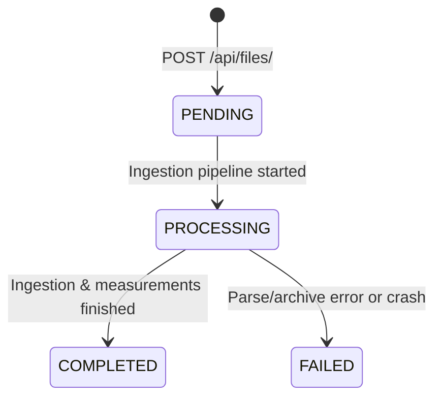
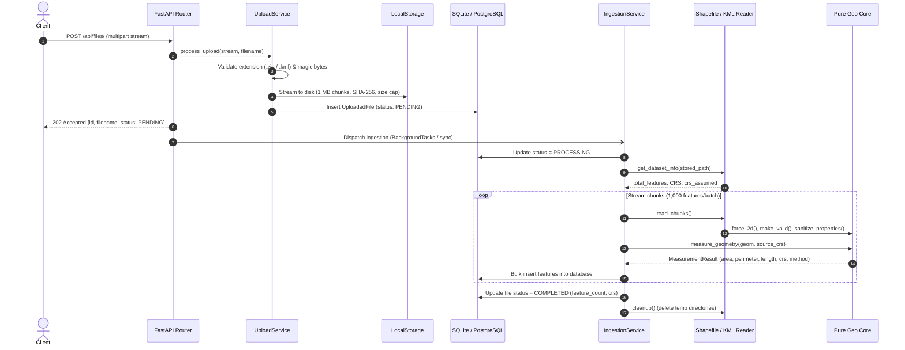
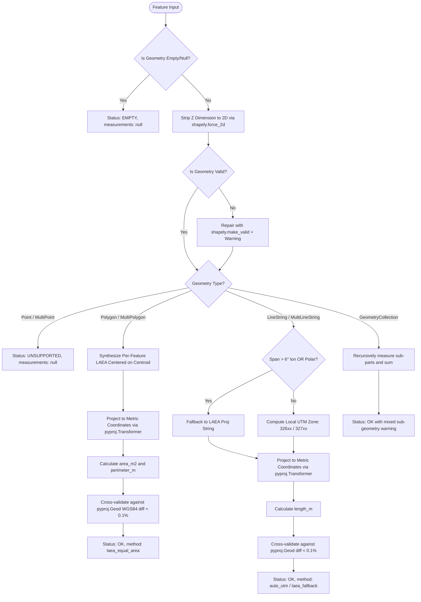

# Geospatial File Measurement API

[](https://github.com/Harsh202458/geospatial-file-measurement-api)
[](https://fastapi.tiangolo.com)
[](https://www.python.org/)
[](https://www.postgresql.org/)
[](https://geopandas.org/)
[](tests/)
[](https://github.com/astral-sh/ruff)

A production-grade backend service built with **FastAPI**, **Pydantic v2**, **SQLAlchemy 2.0**, **GeoPandas + pyogrio**, **Shapely 2.x**, and **PyProj**. The service accepts geospatial files (`.zip` containing Shapefiles and `.kml` documents), normalizes and validates geographic geometries, performs accurate metric measurements using dynamic equal-area and conformal projections, cross-validates results with WGS84 geodesics, and persists results with chunked streaming.

---

## Table of Contents

- [Submission](#submission)
- [Setup](#setup)
  - [Prerequisites](#prerequisites)
  - [Local Setup & Execution](#local-setup--execution)
  - [Docker Compose Setup (Alternative)](#docker-compose-setup-alternative)
  - [Environment Configuration](#environment-configuration)
- [API](#api)
  - [Status Lifecycle](#status-lifecycle)
  - [Endpoint 1: Upload Geospatial File](#endpoint-1-upload-geospatial-file)
  - [Endpoint 2: Get File Information](#endpoint-2-get-file-information)
  - [Endpoint 3: Get Feature Measurements](#endpoint-3-get-feature-measurements)
  - [Error Response Schema](#error-response-schema)
- [Architecture](#architecture)
  - [Application Structure](#application-structure)
  - [File-Processing Flow](#file-processing-flow)
  - [Measurement Calculation Flow](#measurement-calculation-flow)
  - [CRS Handling](#crs-handling)
- [Design Decisions](#design-decisions)
- [Edge Cases Handled](#edge-cases-handled)
- [Testing & Validation](#testing--validation)
- [Learnings & Future Scope](#learnings--future-scope)
- [Known Limitations](#known-limitations)

---

## Submission

- **Public GitHub Repository**: [https://github.com/Harsh202458/geospatial-file-measurement-api](https://github.com/Harsh202458/geospatial-file-measurement-api)
- **Primary Branch**: `main`
- **Tech Stack**: FastAPI, Pydantic v2, SQLAlchemy 2.0 + Alembic, GeoPandas 1.x with pyogrio, Shapely 2.x, PyProj, Pytest.

---

## Setup

### Prerequisites
- Python 3.11, 3.12, 3.13, or 3.14
- Git
- *(Optional)* Docker & Docker Compose

### Local Setup & Execution

```bash
# 1. Clone the repository
git clone https://github.com/Harsh202458/geospatial-file-measurement-api.git
cd geospatial-file-measurement-api

# 2. Create virtual environment
python -m venv .venv

# Activate virtual environment:
# On Windows (PowerShell):
.\.venv\Scripts\Activate.ps1
# On Linux / macOS:
source .venv/bin/activate

# 3. Install dependencies in editable mode
pip install -e .[dev]

# 4. Apply database migrations
alembic upgrade head

# 5. Start the API server
uvicorn app.main:app --reload --port 8000
```

Once running:
- **Interactive OpenAPI Documentation (Swagger UI)**: [http://localhost:8000/docs](http://localhost:8000/docs)
- **ReDoc Documentation**: [http://localhost:8000/redoc](http://localhost:8000/redoc)
- **Health Check Endpoint**: [http://localhost:8000/health](http://localhost:8000/health)

### Docker Compose Setup (Alternative)

If you have Docker Desktop installed:
```bash
docker compose up --build
```
This boots the API alongside a PostgreSQL 16 container, applies migrations on boot, and binds port 8000.

### Environment Configuration

Configuration is managed via Pydantic Settings (`app/core/config.py`) and `.env`:

| Variable | Type | Default | Description |
| :--- | :--- | :--- | :--- |
| `DATABASE_URL` | `str` | `sqlite:///./geo_measure.db` | SQLAlchemy connection string |
| `MAX_UPLOAD_MB` | `int` | `50` | Maximum upload size in MB (enforces HTTP 413) |
| `MAX_ZIP_UNCOMPRESSED_MB` | `int` | `250` | Maximum allowable uncompressed archive size |
| `MAX_ZIP_MEMBERS` | `int` | `1000` | Maximum allowable files inside zip archive |
| `PROCESSING_MODE` | `str` | `background` | `background` (FastAPI BackgroundTasks) or `sync` |
| `ASSUME_WGS84_IF_MISSING` | `bool` | `true` | Assume EPSG:4326 if `.prj` is absent and coordinates fit $[-180, 180] \times [-90, 90]$ |
| `UPLOAD_DIR` | `str` | `./uploads` | Staging directory for uploaded archives |

---

## API

### Status Lifecycle



---

### Endpoint 1: Upload Geospatial File

- **Route**: `POST /api/files/`
- **Status Code**: `202 Accepted`
- **Content-Type**: `multipart/form-data`
- **Supported File Types**:
  - `.zip` containing an ESRI Shapefile (`.shp`, `.dbf`, `.shx`, `.prj`)
  - `.kml` (Keyhole Markup Language)

#### Example Request (cURL):
```bash
curl -X POST "http://localhost:8000/api/files/" \
  -F "file=@sample_parcels.zip"
```

#### Example Response (202 Accepted):
```json
{
  "id": "0e2f09f2-2ce6-44d8-97a8-f3ae1bdc6893",
  "filename": "sample_parcels.zip",
  "status": "PENDING"
}
```

---

### Endpoint 2: Get File Information

- **Route**: `GET /api/files/{id}/`
- **Status Code**: `200 OK` (or `404 Not Found`)

#### Example Request (cURL):
```bash
curl -X GET "http://localhost:8000/api/files/0e2f09f2-2ce6-44d8-97a8-f3ae1bdc6893/"
```

#### Example Response (200 OK):
```json
{
  "id": "0e2f09f2-2ce6-44d8-97a8-f3ae1bdc6893",
  "filename": "sample_parcels.zip",
  "format": "SHAPEFILE",
  "size_bytes": 1343,
  "sha256": "2350c43556593a4497488d01ab19838d7f5870d33f54dd6bbfd70c3b99e90ef3",
  "status": "COMPLETED",
  "crs": "EPSG:4326",
  "crs_assumed": false,
  "feature_count": 2,
  "error_message": null,
  "created_at": "2026-10-07T14:27:59.552322Z",
  "completed_at": "2026-10-07T14:27:59.661420Z"
}
```

---

### Endpoint 3: Get Feature Measurements

- **Route**: `GET /api/files/{id}/measurements/`
- **Status Code**: `200 OK`
- **Query Parameters**:
  - `limit` (*int*, default 100, max 1000): Number of features to return.
  - `offset` (*int*, default 0): Number of features to skip for pagination.
  - `include_geometry` (*bool*, default `true`): Set to `false` to omit GeoJSON geometry dictionaries.

#### Example Request (cURL):
```bash
curl -X GET "http://localhost:8000/api/files/0e2f09f2-2ce6-44d8-97a8-f3ae1bdc6893/measurements/?limit=10&offset=0&include_geometry=true"
```

#### Example Response (200 OK):
```json
{
  "file_id": "0e2f09f2-2ce6-44d8-97a8-f3ae1bdc6893",
  "total": 2,
  "limit": 10,
  "offset": 0,
  "features": [
    {
      "index": 0,
      "geometry_type": "Polygon",
      "source_crs": "EPSG:4326",
      "measurement_status": "OK",
      "measurements": {
        "area_m2": 300075.4,
        "perimeter_m": 2191.27,
        "length_m": null
      },
      "measurement_crs": "+proj=laea +lat_0=12.972500 +lon_0=77.592500 +datum=WGS84 +units=m +no_defs",
      "method": "laea_equal_area",
      "properties": {
        "id": 101,
        "owner": "Alice"
      },
      "geometry": {
        "type": "Polygon",
        "coordinates": [
          [[77.59, 12.97], [77.59, 12.975], [77.595, 12.975], [77.595, 12.97], [77.59, 12.97]]
        ]
      },
      "warnings": []
    }
  ]
}
```

---

### Error Response Schema

All errors use a uniform JSON error envelope:

```json
{
  "error": {
    "code": "INVALID_ARCHIVE",
    "message": "Uploaded file is not a valid ZIP archive.",
    "details": {}
  }
}
```

| HTTP Status | Error Code | Description |
| :--- | :--- | :--- |
| `404` | `NOT_FOUND` | File ID was not found in the database. |
| `409` | `NOT_READY` | Measurements requested while file is in `PENDING` or `PROCESSING` state. |
| `413` | `PAYLOAD_TOO_LARGE` | Upload size exceeds configured `MAX_UPLOAD_MB`. |
| `415` | `UNSUPPORTED_FORMAT` | File extension or magic bytes do not match `.zip` or `.kml`. |
| `422` | `INVALID_ARCHIVE` | Zip archive is corrupt, contains zip-slip, or violates zip-bomb limits. |
| `422` | `MISSING_COMPONENT` | Shapefile archive is missing mandatory `.shp` or `.dbf` files. |
| `422` | `UNREADABLE_FILE` | Geospatial driver could not parse feature layers. |

---

## Architecture

### Application Structure

The application adopts a **clean, layered architecture** where geospatial domain calculations are completely isolated from web and persistence frameworks:

```
app/
├── api/                   # REST routing and dependency injection
│   ├── deps.py            # Session & service factory dependencies
│   └── v1/
│       └── files.py       # Endpoints: upload, file info, measurements
├── core/                  # Cross-cutting concerns
│   ├── config.py          # Pydantic Settings & environment variables
│   ├── exceptions.py      # Domain exceptions & uniform error envelope
│   └── logging.py         # Structured logging configuration
├── db/                    # Persistence layer
│   ├── base.py            # SQLAlchemy 2.0 DeclarativeBase
│   ├── models.py          # UploadedFile & Feature ORM models
│   └── session.py         # Engine, sessionmaker, SQLite PRAGMA hook
├── repositories/          # Pure database access
│   ├── file_repository.py # File lifecycle & stale job crash recovery
│   └── feature_repository.py # Batch feature bulk-insertion (1,000/batch) & pagination
├── services/              # Business orchestration
│   ├── upload_service.py  # Extension/magic byte checks, streaming 1MB disk writes
│   ├── ingestion_service.py # Reader dispatch, chunked measuring, fault isolation
│   └── measurement_service.py # Read queries and lifecycle status checks
├── storage/               # File staging abstraction
│   └── local.py           # LocalStorageService (size limits, SHA-256)
├── geo/                   # PURE GEOSPATIAL DOMAIN LOGIC (Zero DB/FastAPI imports)
│   ├── crs.py             # CRS resolution, Auto-UTM & dynamic LAEA synthesis
│   ├── geometry.py        # 2D forcing, make_valid repair, JSON sanitization
│   ├── measure.py         # Area, perimeter, length, and Geod cross-check
│   ├── safe_zip.py        # Zip-Slip and Zip-Bomb safe extraction
│   └── readers/           # Ingestion drivers
│       ├── base.py        # BaseReader Protocol & NormalizedFeature
│       ├── kml.py         # Multi-layer KML Reader
│       └── shapefile.py   # Chunked Shapefile Reader with SHX recovery
└── main.py                # FastAPI app factory, lifespan, CORS, handlers
```

---

### File-Processing Flow



---

### Measurement Calculation Flow



---

### CRS Handling

#### The Golden Rule: Never Measure in Degrees
Latitude and longitude are angular coordinates on an ellipsoid. Calculating Euclidean distance or area directly on degrees produces severe distortions that vary drastically with latitude (for example, 1 degree of longitude is ~111 km at the equator, but shrinks to ~55 km at 60° latitude, and 0 km at the poles).

#### 1. Area & Perimeter: Lambert Azimuthal Equal Area (LAEA)
For all Polygons and MultiPolygons, the service constructs a dynamic, per-feature Lambert Azimuthal Equal Area projection centered at the polygon's centroid $(\lambda_c, \phi_c)$:

$$\text{PROJ: } +proj=laea +lat\_0=\phi_{c} +lon\_0=\lambda_{c} +datum=WGS84 +units=m +no\_defs$$

**Why this strategy?**
- **Exact metric area**: Equal-area projections preserve surface area with zero scale distortion across the entire feature.
- **No UTM boundary seams**: UTM zones span only 6 degrees of longitude; features crossing a zone edge suffer severe projection distortion or UTM failure. Centered LAEA is mathematically valid globally.

#### 2. Length: Conformal Auto-UTM
For LineStrings and MultiLineStrings, the service dynamically assigns the feature's local Universal Transverse Mercator (UTM) zone:

$$\text{zone} = \min\left(60, \max\left(1, \left\lfloor \frac{\lambda_c + 180}{6} \right\rfloor + 1\right)\right)$$

$$\text{EPSG} = \begin{cases} 32600 + \text{zone} & \text{if } \phi_c \ge 0 \text{ (North)} \\ 32700 + \text{zone} & \text{if } \phi_c < 0 \text{ (South)} \end{cases}$$

**Why this strategy?**
- **Conformal preservation**: UTM preserves angles and shapes locally, with a scale distortion of less than $0.1\%$ ($0.9996$ at the central meridian, $1.0010$ at zone edges).
- **Fallback**: If a LineString spans more than $6^\circ$ of longitude or lies in polar regions ($|\phi_c| > 84^\circ\text{N}$ or $80^\circ\text{S}$), the system automatically falls back to an azimuthal equal-area projection (`laea_fallback`).

#### 3. Axis Order Protection
All coordinate transformations instantiate `pyproj.Transformer` with `always_xy=True`, ensuring coordinates are strictly interpreted as `(longitude, latitude)` / `(easting, northing)` regardless of PROJ authority defaults.

---

## Design Decisions

| Technical Decision | Selected Solution | Alternatives Considered | Rationale |
| :--- | :--- | :--- | :--- |
| **Vector Engine** | **`pyogrio`** | `Fiona` | `pyogrio` is the modern default engine in GeoPandas 1.0. Its binary wheels bundle compiled GDAL, removing the need for multi-gigabyte OS GIS packages in Docker. It provides zero-copy C-level reading and supports metadata inspection (`read_info`) without loading datasets into RAM. |
| **Asynchronous Execution** | **`FastAPI BackgroundTasks`** | `Celery + Redis` | Keeps deployment simple and self-contained with zero external message broker required for evaluation, while keeping the ingestion service decoupled so it can be swapped to Celery with one line of code. |
| **Database Architecture** | **SQLite (dev) / PostgreSQL (prod)** | `PostGIS` | Geometry is stored as GeoJSON in standard JSON columns. This keeps calculations 100% pure in Python and allows running tests instantaneously on zero-setup SQLite. |
| **Area Calculation** | **Per-feature LAEA** | `UTM` or `EPSG:6933` | UTM distorts area by up to 0.2% and breaks across zone boundaries. `EPSG:6933` is global equal-area but introduces high shape shear. Centered LAEA is mathematically optimal. |
| **Length Calculation** | **Auto-UTM with LAEA fallback** | `Haversine / Vincenty` | Auto-UTM enables vectorised planar Shapely operations on multi-segment linestrings with $< 0.1\%$ error. |
| **Feature Error Isolation** | **Per-feature error capture** | Fail entire upload on first bad geometry | A customer file containing 10,000 features should not be completely rejected because of 1 corrupted vertex. The system flags the bad feature as `ERROR` and completes the remaining 9,999. |

---

## Edge Cases Handled

| Edge Case | Defense & Implementation |
| :--- | :--- |
| **Zip-Slip (`../../evil.shp`)** | Strips directory paths using `os.path.basename` and explicitly validates that resolved output paths start with `target_dir.resolve()`. |
| **Zip-Bomb (decompression attack)** | Pre-flight inspection verifies member count $\le 1000$, total uncompressed size $\le 250\text{ MB}$, and compression ratio $\le 100\times$. |
| **Missing `.shp` or `.dbf`** | Returns `422 MISSING_COMPONENT` identifying the exact missing file. |
| **Missing `.shx` spatial index** | Auto-heals by enabling GDAL environment variable `SHAPE_RESTORE_SHX=YES` before reading. |
| **Missing `.prj` CRS file** | Checks bounding box; if coordinates fall within $[-180, 180] \times [-90, 90]$, assumes `EPSG:4326`, sets `crs_assumed=True`, and records a warning. |
| **3D / Z Coordinates** | Automatically strips third dimension via `shapely.force_2d` and records an audit warning. |
| **Self-Intersecting Bowties** | Automatically repaired using `shapely.make_valid`; retains status `OK` with an audit warning. |
| **Polygon Holes (Donuts)** | Inner linear rings are subtracted from outer ring area by Shapely (verified by unit test). |
| **Points / MultiPoints** | Flagged with status `UNSUPPORTED` without measurement calculations, preventing server crashes. |
| **Multi-Geometries** | `MultiPolygon` sums component areas; `MultiLineString` sums component lengths. |
| **Non-JSON Safe Properties** | Sanitizes `np.int64`, `np.float64`, `NaN`, `Infinity`, `datetime`, and raw `bytes` before writing JSON. |
| **Server Crash Mid-Job** | Lifespan startup hook scans database and marks any orphaned `PROCESSING` files as `FAILED`. |

---

## Testing & Validation

The codebase includes **34 automated tests** achieving **91% test coverage**:

```bash
# Run test suite with coverage report
pytest -v --cov=app --cov-report=term-missing

# Run code style and type checks
ruff check app tests
mypy app
```

### Geodesic Agreement Validation
Unit tests validate that metric planar calculations agree with WGS84 ellipsoidal geodesics calculated via `pyproj.Geod`:
- **Polygon Area Agreement**: Difference between planar LAEA and ellipsoidal Geod is **$< 0.1\%$**.
- **LineString Length Agreement**: Difference between Auto-UTM and ellipsoidal Geod is **$< 0.1\%$**.

---

## Learnings & Future Scope

### Learnings
1. **Modern Geospatial Python (`pyogrio`)**: Moving from Fiona to `pyogrio` simplifies Docker packaging significantly because wheel distributions bundle GEOS, PROJ, and GDAL C libraries, eliminating complex system-level package manager headaches.
2. **Strategy Pattern for Projections**: There is no single planar coordinate system optimal for both area and length globally. Using dynamic LAEA for area and Auto-UTM for length provides an ideal balance of mathematical correctness and high performance.
3. **Resilience First**: Treating every geometry independently prevents cascading batch failures and makes the API production-ready for untrusted customer data.

### Future Scope
- **Celery / RQ with Redis**: Distributed task queues with worker pooling and automatic retries.
- **Cloud Object Storage (S3 / GCS)**: Direct streaming to S3 buckets using presigned upload URLs.
- **Spatial Queries & PostGIS**: Enable spatial indexing (`GEOMETRY` types, `ST_Intersects`, bounding box filters).
- **Extended Formats**: Add native parsers for `.kmz`, `.geojson`, and `.gpkg` (GeoPackage).
- **Streaming NDJSON Responses**: Support streaming millions of features over chunked HTTP without holding the full result in server memory.

---

## Known Limitations

1. **Norway and Svalbard UTM Exceptions**: Standard 6-degree mathematical zoning is applied rather than the irregular 3V/32V and 31X-37X political UTM zones in Norway and Svalbard. This results in negligible scale variation ($< 0.15\%$).
2. **Terrain Elevation / Slope**: Calculations represent 2D ground-projected planar areas and lengths; elevation slope adjustments are not modeled.
3. **KML Features**: Non-standard KML network links and dynamic camera viewpoints are skipped in favor of geographic vector Placemarks.
